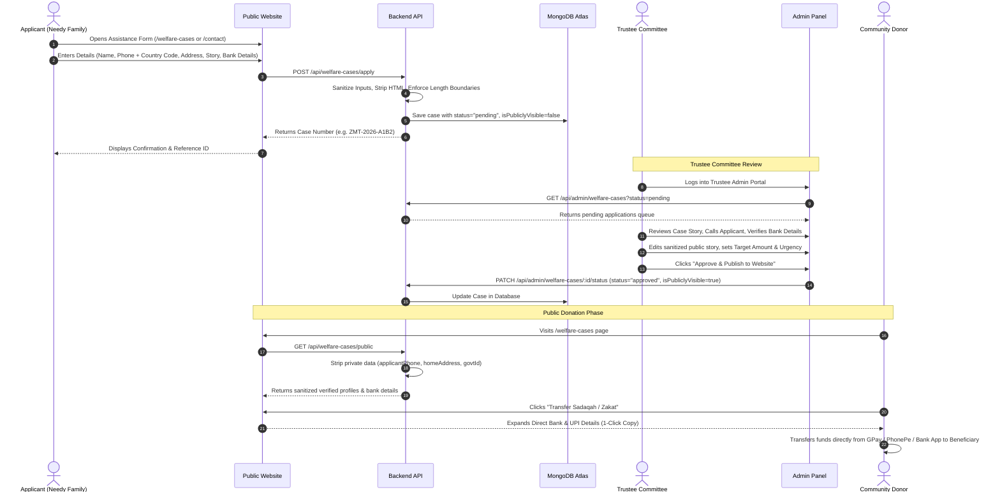
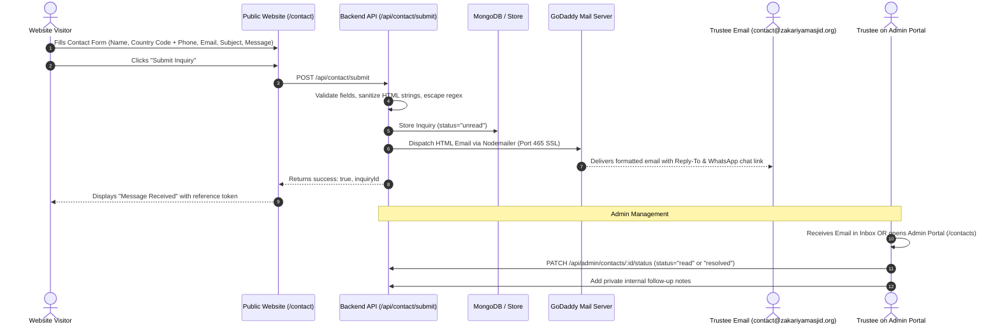
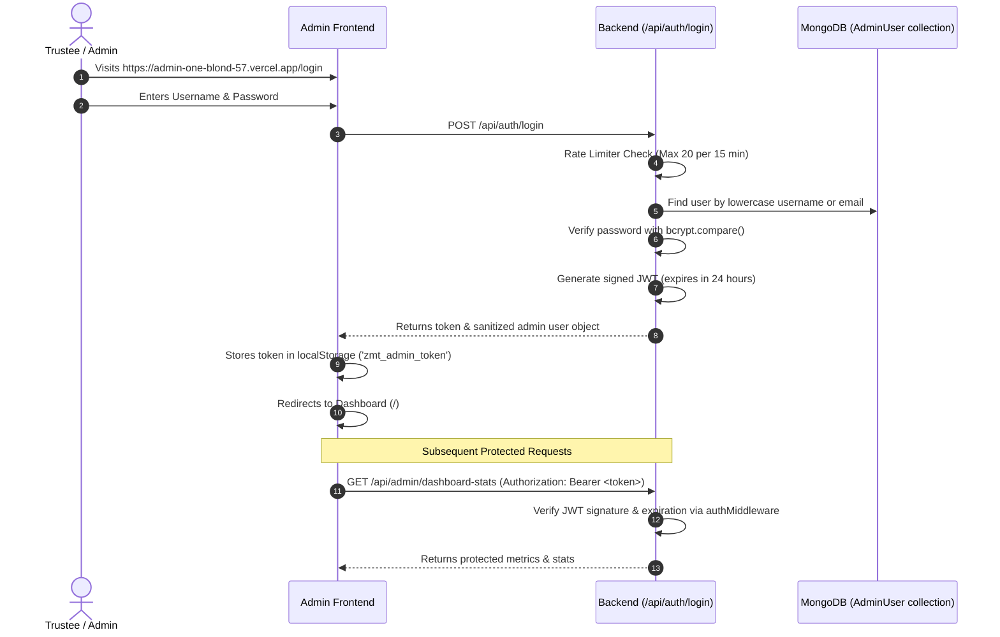

# 🕌 Zakariya Masjid & Kabrastan Trust — Complete System Flow

This document details the complete end-to-end user journeys, system architectures, data flows, and state transitions of the Zakariya Masjid & Kabrastan Trust web application.

---

## 🏛️ 1. High-Level Architecture Overview

The system consists of three distinct, loosely coupled services:

```
┌─────────────────────────────────────────────────────────────────────────────┐
│                            1. PUBLIC WEBSITE                                │
│                     (Vite + React SPA + Tailwind CSS)                       │
│                   https://frontend-seven-rosy-33.vercel.app                 │
│                                                                             │
│  • Prayer Timings & Jumu'ah        • Kabristan Burial Assistance            │
│  • Public Welfare Donation Cases   • Financial Transparency                 │
│  • Online Assistance Application   • Multilingual Contact Form              │
└───────────────────────┬─────────────────────────────▲───────────────────────┘
                        │ HTTP POST (Applications)    │ HTTP GET (Live Data)
                        │ HTTP POST (Contact Inquiries)
                        ▼                             │
┌─────────────────────────────────────────────────────┴───────────────────────┐
│                           2. BACKEND API SERVICE                            │
│                  (Node.js + Express + TypeScript + MongoDB)                 │
│                   https://zakariyamasjid-backend.vercel.app                 │
│                                                                             │
│  • Security Middleware (Helmet, CORS, Rate Limiters, Sanitization)          │
│  • Welfare Cases Controller (Approval, Sanitization, Masking)               │
│  • Contact Controller & GoDaddy SMTP Notification Dispatcher                │
│  • JWT Admin Authentication & Role-Based Access Control                     │
│  • Dual-Persistence Engine (MongoDB Atlas + In-Memory Fallback)             │
└───────────────────────▲─────────────────────────────┬───────────────────────┘
                        │ JWT Auth / Mutations        │ HTTP GET (Admin Inboxes)
                        │ Status Updates & Notes      │ Verification Queues
┌───────────────────────┴─────────────────────────────▼───────────────────────┐
│                         3. TRUSTEE ADMIN PORTAL                             │
│                     (Vite + React SPA + Tailwind CSS)                       │
│                    https://admin-one-blond-57.vercel.app                    │
│                                                                             │
│  • Secure Trustee Login & Session Management                                │
│  • Welfare Verification Queue (Review, Approve, Edit, Reject)               │
│  • Contact Inquiries Desk (WhatsApp, Call, Email, Statuses, Notes)          │
│  • Real-Time Metrics & Analytics Dashboard                                  │
└─────────────────────────────────────────────────────────────────────────────┘
```

---

## 🔄 2. Core User Flows & Journeys

---

### 🌊 Flow A: Community Welfare Assistance Request & Trustee Approval



---

### 📬 Flow B: Public Contact Inquiry & Automated Email Notification



---

### 🔐 Flow C: Admin Authentication & Session Management



---

## 🗂️ 3. State Lifecycle Models

### Welfare Case Lifecycle
```
[User Submits Form]
         │
         ▼
    ┌─────────┐
    │ PENDING │  ◄── Hidden from public website, only visible in Admin Queue
    └────┬────┘
         │
         ├──────────────────────────┐
         ▼                          ▼
   ┌──────────┐               ┌──────────┐
   │ APPROVED │               │ REJECTED │
   └─────┬────┘               └──────────┘
         │
         │  ◄── Publicly visible on /welfare-cases for direct donor transfers
         │
         ▼
   ┌───────────┐
   │ COMPLETED │  ◄── Archived once target amount is fulfilled
   └───────────┘
```

### Contact Inquiry Lifecycle
```
[User Submits Contact Form]
         │
         ▼
    ┌────────┐
    │ UNREAD │  ◄── Triggers instant email to contact@zakariyamasjid.org + pulsing alert in Admin
    └───┬────┘
        │
        ├───────────────────────────┐
        ▼                           ▼
    ┌──────┐                  ┌──────────┐
    │ READ │ ── (Follow-up) ──►│ RESOLVED │
    └──────┘                  └──────────┘
```
